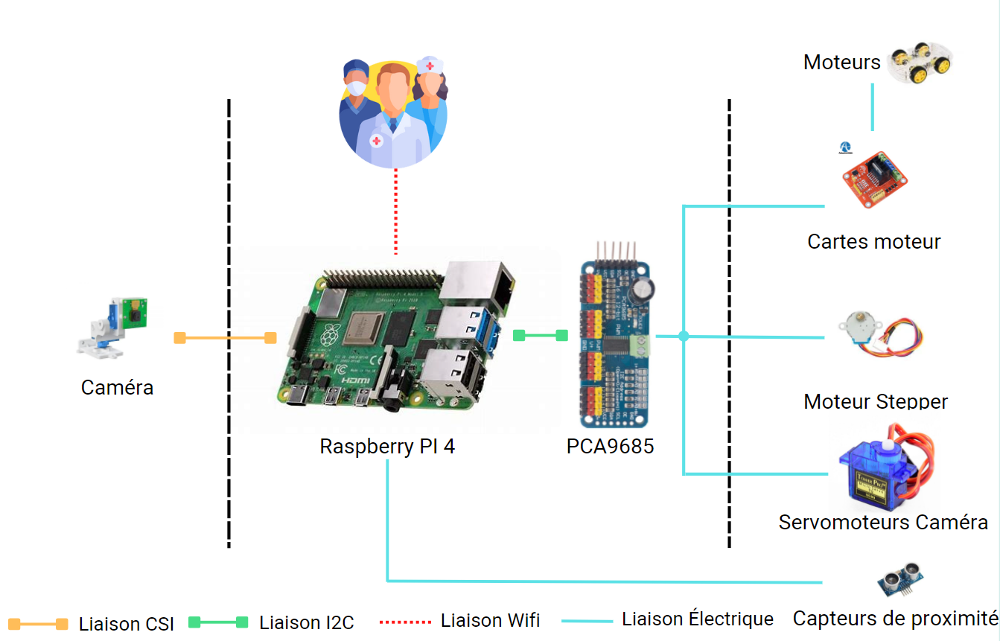
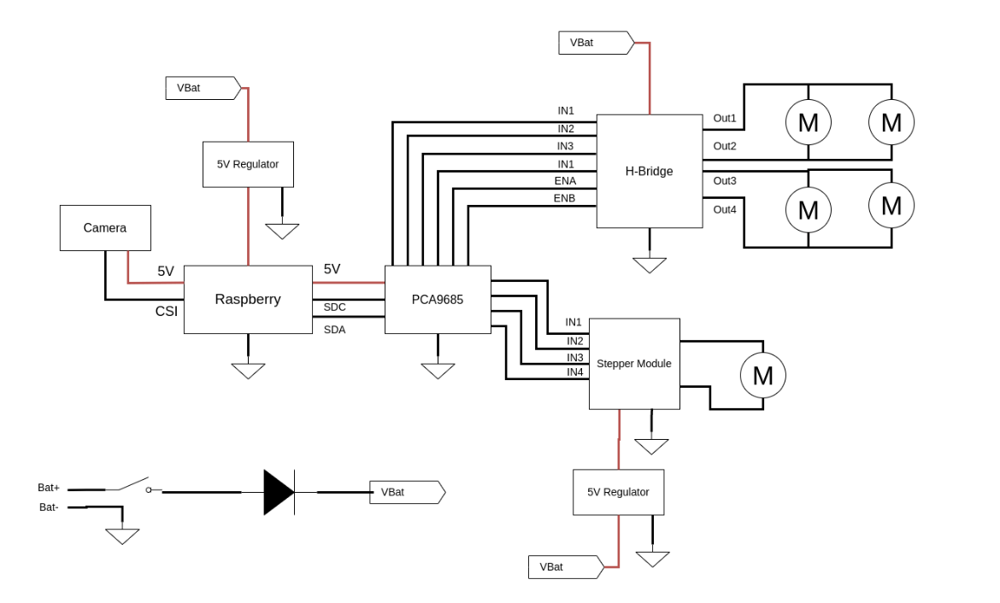

# Robear

Ceci est un projet de robotique conçu dans le cadre des projets de BAC+4 à l'école d'ingénieur ESIEE Paris. A raison d'une journée par semaine pendant 2 mois.

Pour ce projet, nous avions l'ambition de construire un robot téléguidé par WiFi permettant d'apporter des médicaments aux patients très contagieux sans exposer les soignants.

## Mécanique

Nous somme partis sur une base de robot en kit [Joy-IT Robot-03](https://joy-it.net/files/files/Produkte/Robot03/Robot03-Manual-20201023.pdf) sur lequel nous avons fixé un Raspberry, une caméra RPi, un PCA9685 afin de fournir les signaux PWM.

Nous avons fixé sur le dessus un chariot élévateur en Lego capable de monter et descendre grâce à un vérin actionné par un moteur pas-a-pas.

## Electronique

### Optimisations

Pour optimiser la batterie du robot, ajoutez ceci au /etc/rc.local :

#### Ports USB

Pour désactiver les ports USB (~100mA) avec un **RPi 3** :

```bash
echo '1-1' | sudo tee /sys/bus/usb/drivers/usb/unbind
```

Pour les **RPi 4** (pas testé, à utiliser avec prudence) : il faut d'abord executer

```bash
sudo apt-get install uhubctl
sudo rpi-eeprom-update
```

Puis ajouter ceci à /etc/rc.local :

```bash
uhubctl -l 1-1 -p 2 -a 0 -r 1 
```

#### Ports HDMI

Pour désactiver les ports HDMI (~20mA) :

```bash
sudo /opt/vc/bin/tvservice -o
```




